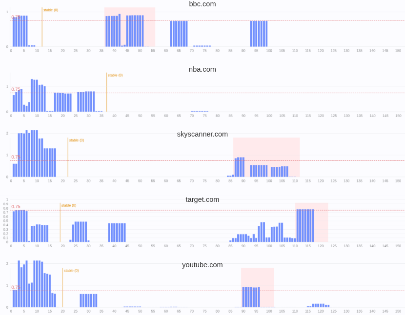

# DOMQuake

Observe UI state on any web page.


``` js
new DOMQuake()
  .on("transition", pauseAgentCalls)
  .on("stable", resumeAgentCalls)
  .observe();

new DOMQuake({
  root: document.querySelector("footer"),
  threshold: 0.9  // (think of 90% UI change; default: 0.75)
})
  .once("transition", ({ intensity }) => {
    console.log("Intensity": intensity);
  })
  .observe();

// .state
// .isObserving
```

### Integrate

#### Browser

``` html
<script src="https://cdn.jsdelivr.net/gh/webfuse-com/DOMQuake@main/dist.browser/DOMQuake.js"></script>
```

#### Module

``` console
npm install webfuse-com/DOMQuake
```

``` js
import "@webfuse-com/domquake";
```

### Run Demo

``` console
npm run demo -- [<URL> [<THRESHOLD>]]
```

```
npm run demo
npm run demo -- https://www.webfuse.com 0.5
```

### Example



### A 2-State Machine & Event Emitter

**DOMQuake** is a framework-agnostic web application state machine. It works in any web application – whether static or hydrated. The state machine transitions between `stable` and `transition` state based on whether a continuously sampled DOM mutation intensity surpasses a defined threshold. Intensity, at that, is a score that reflects the structural significance of a sliding window of mutations. It applies an adaptive decay model to distinguish UI page transitions from noise (e.g., a slider). The state machine is exposed through an event emitter interface. The default intensity threshold is `0.75`.